

  <h1>
     
    Flutter Plant App
  </h1>
  <h3>A Modern Plant Shopping Application with Clean UI</h3>

    
    

## 📌 Overview

A beautifully designed Flutter application for plant enthusiasts to browse, favorite, and purchase plants. The app features a clean and modern UI with smooth animations and a seamless shopping experience.

## 🚀 Tech Stack

- **Flutter** (UI Framework)
- **Provider** (State Management)
- **Clean Architecture**
- **Custom Animations**

## 🔑 Key Features

- ✅ **Authentication**: Secure user login and signup
- ✅ **Plant Catalog**: Browse various plant categories
- ✅ **Favorites**: Save and manage favorite plants
- ✅ **Shopping Cart**: Easy checkout process
- ✅ **User Profile**: Personalized user experience
- ✅ **Plant Details**: Detailed information about each plant
- ✅ **Search**: Find plants quickly
- ✅ **Responsive Design**: Works on all screen sizes

## 📸 Banner

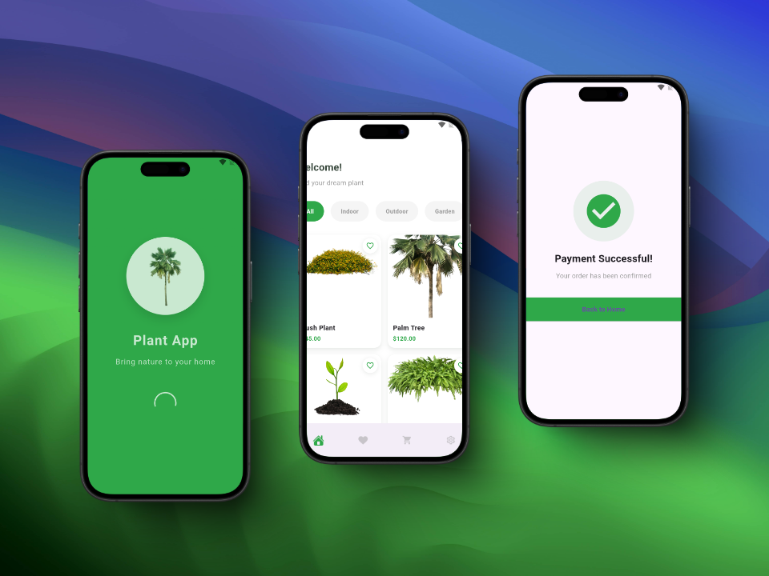

## 📸 Screenshots

### Authentication & Welcome

<table border="1">
  <tr>
    <td align="center">
      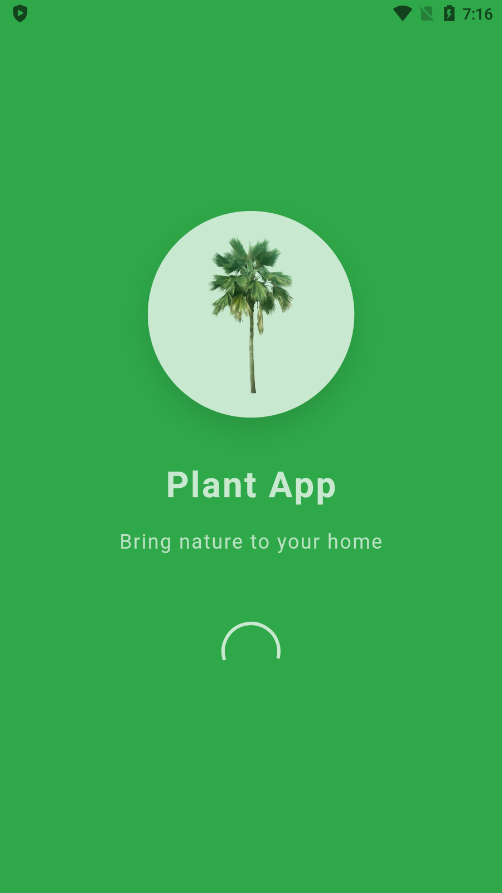
      
<b>Splash Screen</b>

    </td>
    <td align="center">
      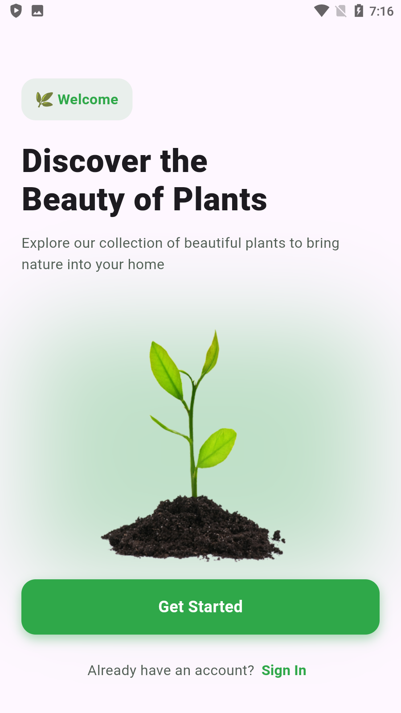
      
<b>Welcome Screen</b>

    </td>
    <td align="center">
      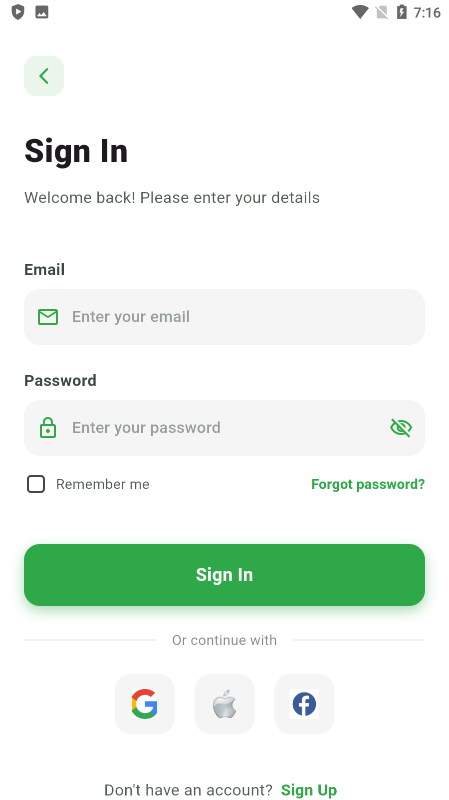
      
<b>Login Screen</b>

    </td>
  </tr>
  <tr>
    <td align="center">
      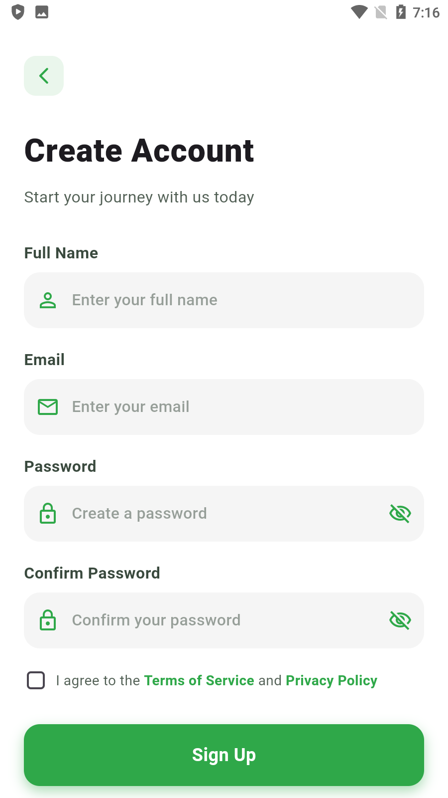
      
<b>Signup Screen</b>

    </td>
  </tr>
</table>

### Main Features

<table border="1">
  <tr>
    <td align="center">
      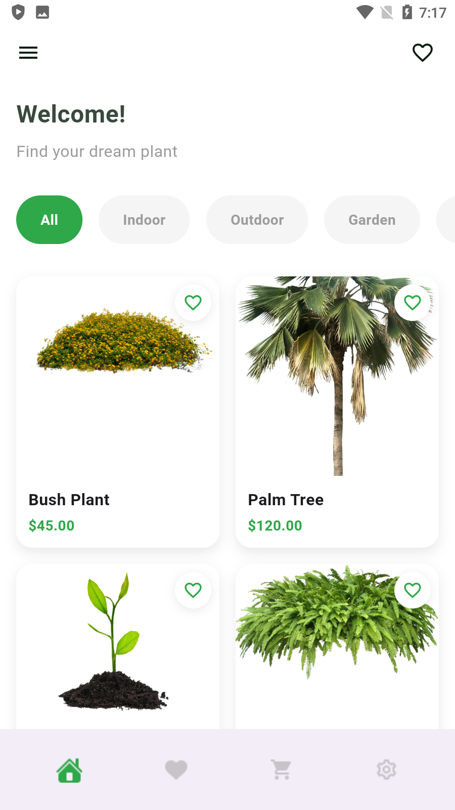
      
<b>Home Screen</b>

    </td>
    <td align="center">
      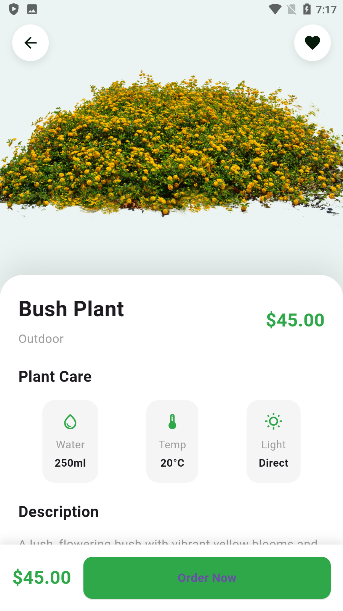
      
<b>Plant Details</b>

    </td>
    <td align="center">
      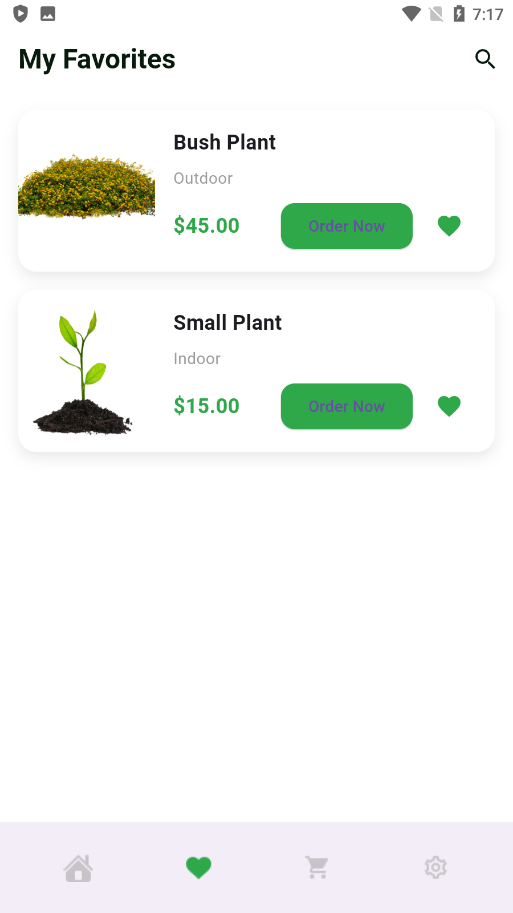
      
<b>Favorites</b>

    </td>
  </tr>
  <tr>
    <td align="center">
      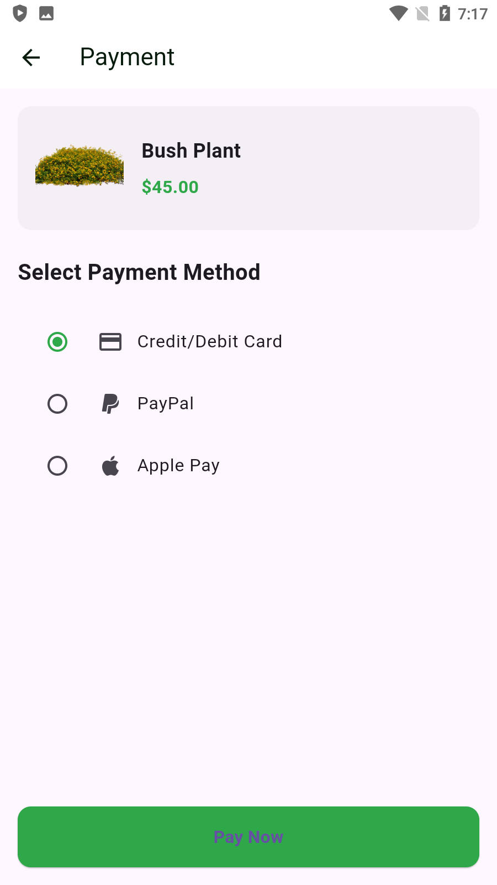
      
<b>Checkout Process</b>

    </td>
    <td align="center">
      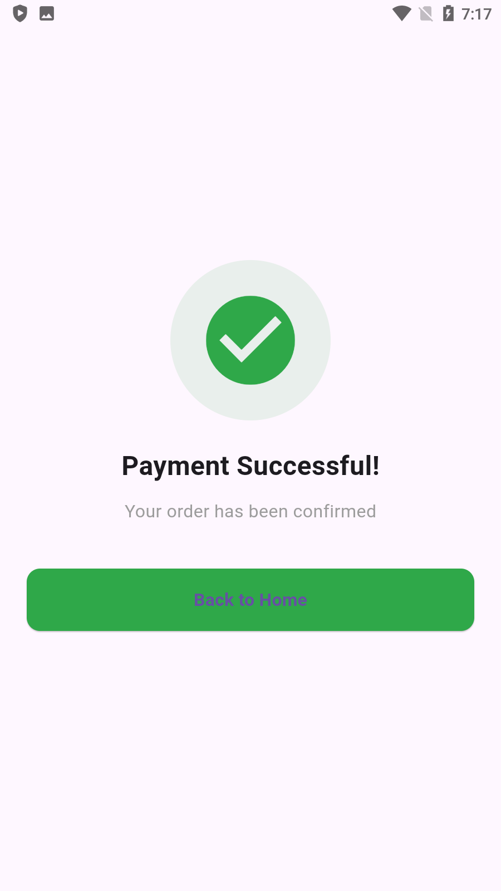
      
<b>Payment Success</b>

    </td>
    <td align="center">
      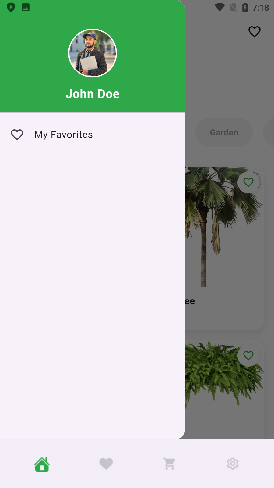
      
<b>Navigation Menu</b>

    </td>
  </tr>
</table>

### Settings & About

<table border="1">
  <tr>
    <td align="center">
      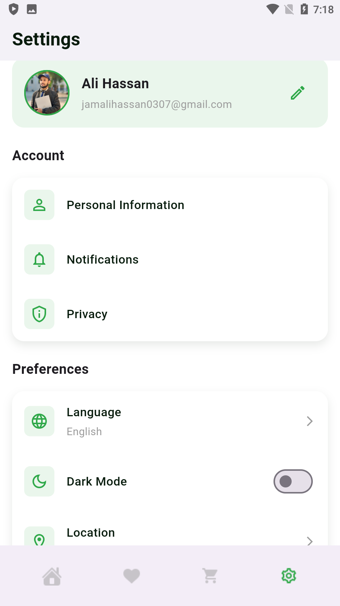
      
<b>Settings Screen</b>

    </td>
    <td align="center">
      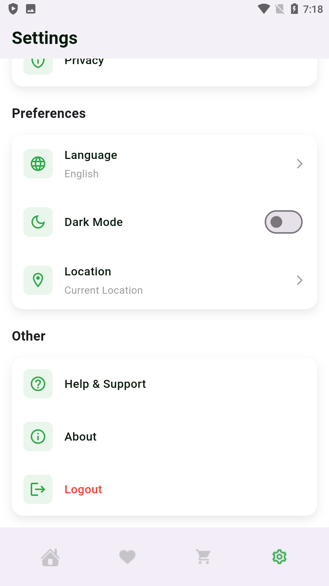
      
<b>Settings Detail</b>

    </td>
    <td align="center">
      
      
<b>About Screen</b>

    </td>
  </tr>
</table>

## �� Project Structure
