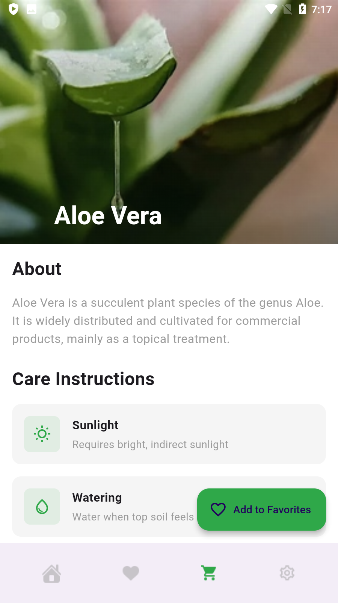

<div align="center">
  <h1>
    <br/>
    Flutter Plant App
  </h1>
  <h3>A Modern Plant Shopping Application with Clean UI</h3>
</div>

<p align="center">
    <a href="https://github.com/jamalihassan0307/" target="_blank">
        
    </a>
    <a href="https://www.linkedin.com/in/jamalihassan0307/" target="_blank">
        
    </a>
</p>

## 📌 Overview

A beautifully designed Flutter application for plant enthusiasts to browse, favorite, and purchase plants. The app features a clean and modern UI with smooth animations and a seamless shopping experience.

## 🚀 Tech Stack

- **Flutter** (UI Framework)
- **Provider** (State Management)
- **Clean Architecture**
- **Custom Animations**

## 🔑 Key Features

- ✅ **Authentication**: Secure user login and signup
- ✅ **Plant Catalog**: Browse various plant categories
- ✅ **Favorites**: Save and manage favorite plants
- ✅ **Shopping Cart**: Easy checkout process
- ✅ **User Profile**: Personalized user experience
- ✅ **Plant Details**: Detailed information about each plant
- ✅ **Search**: Find plants quickly
- ✅ **Responsive Design**: Works on all screen sizes

## 📸 Banner


## 📸 Screenshots

### Authentication & Welcome

<table border="1">
  <tr>
    <td align="center">
      
      <p><b>Splash Screen</b></p>
    </td>
    <td align="center">
      
      <p><b>Welcome Screen</b></p>
    </td>
    <td align="center">
      
      <p><b>Login Screen</b></p>
    </td>
  </tr>
  <tr>
    <td align="center">
      
      <p><b>Signup Screen</b></p>
    </td>
  </tr>
</table>

### Main Features

<table border="1">
  <tr>
    <td align="center">
      
      <p><b>Home Screen</b></p>
    </td>
    <td align="center">
      
      <p><b>Plant Details</b></p>
    </td>
    <td align="center">
      
      <p><b>Favorites</b></p>
    </td>
  </tr>
  <tr>
    <td align="center">
      
      <p><b>Checkout Process</b></p>
    </td>
    <td align="center">
      
      <p><b>Payment Success</b></p>
    </td>
    <td align="center">
      
      <p><b>Navigation Menu</b></p>
    </td>
  </tr>
</table>

### Settings & About

<table border="1">
  <tr>
    <td align="center">
      
      <p><b>Settings Screen</b></p>
    </td>
    <td align="center">
      
      <p><b>Settings Detail</b></p>
    </td>
    <td align="center">
      
      <p><b>About Screen</b></p>
    </td>
  </tr>
</table>

## �� Project Structure

````lib/
├── Screen_page/
│ ├── home_page.dart
│ ├── details_page.dart
│ ├── favorites_page.dart
│ └── settings_page.dart
├── widgets/
│ ├── app_drawer.dart
│ └── bottom_nav.dart
├── utils/
│ ├── app_data.dart
│ └── toast_helper.dart
├── const/
│ └── color.dart
├── List_data/
│ ├── plant_data.dart
│ └── plant_model.dart
└── main.dart```

## 📱 Download APK

You can download the latest version of the app from:
[APK/app-armeabi-v7a-release.apk](APK/app-armeabi-v7a-release.apk)

## 👨‍💻 Developer

Developed by [Jam Ali Hassan](https://github.com/jamalihassan0307)

---

<p align="center">
  Made with ❤️ using Flutter
</p>

````
